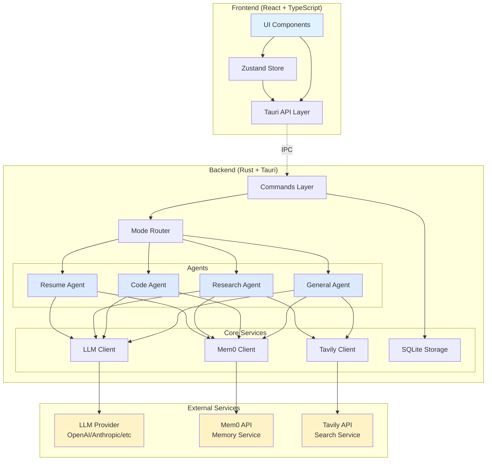
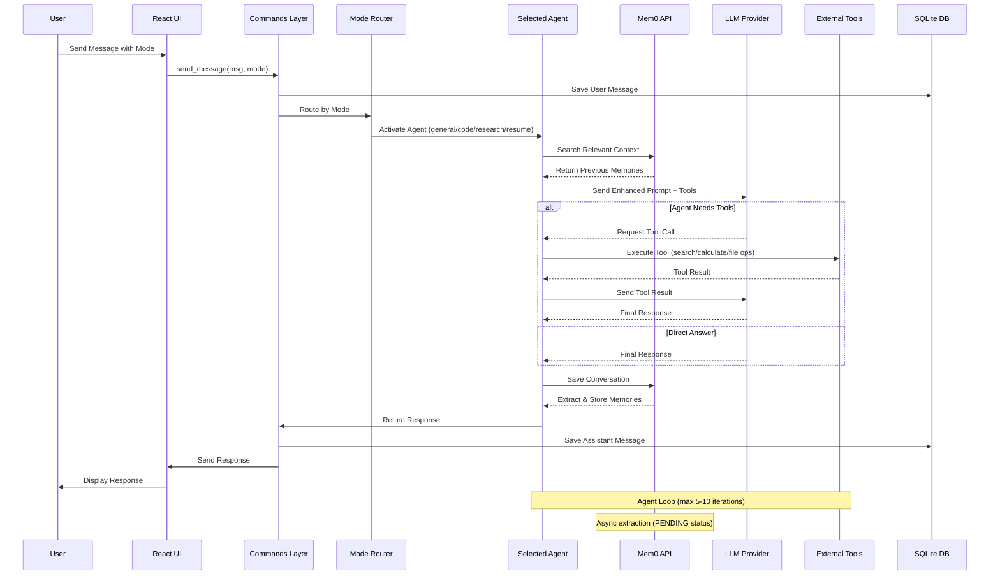
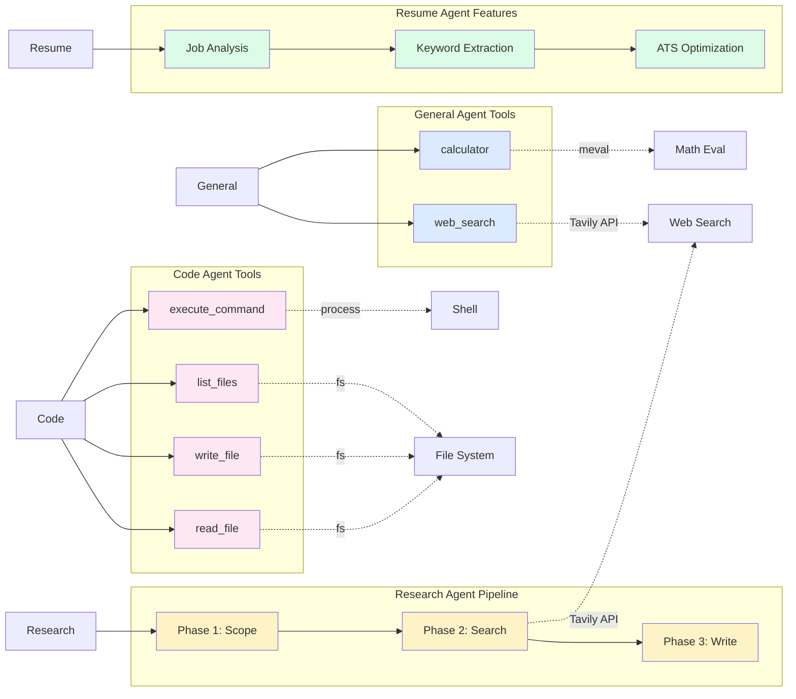

# MyClaude

<div align="center">
  
  **A modern, production-grade AI assistant with specialized agents built with Rust and React**
  
  [](https://www.rust-lang.org/)
  [](https://reactjs.org/)
  [](https://tauri.app/)
  [](LICENSE)
</div>

---

## ✨ Features

### 🎯 Core Features
- 💬 **Multi-Mode Interface** - 4 specialized agent modes for different tasks
- 🤖 **Intelligent Agents** - Tool-enabled agents with memory
- 📁 **File Upload** - Drag and drop files into conversations
- 📚 **Conversation History** - Persistent SQLite storage with Mem0 memory
- 🔧 **Configurable** - Multiple LLM providers support
- 🎨 **Beautiful UI** - Modern Mainline theme with Inter font
- 🧠 **Memory System** - Mem0 integration for context retention

### 🚀 Agent Modes

#### 💬 General Mode
- General-purpose Q&A with tool support
- **Tools**: Web search (Tavily), Calculator
- Smart tool selection based on context
- Suitable for: Knowledge questions, calculations, current events

#### 💻 Code Mode
- Advanced programming assistant
- **Tools**: read_file, write_file, list_files, execute_command
- Agent loop with up to 10 iterations
- Generates actual working code
- Suitable for: Software development, code review, debugging

#### 🔍 Research Mode
- Deep research with multi-phase pipeline
- **Pipeline**: Scope → Research → Write
- **Advanced Search**: 10 results per query, 5 content chunks
- Generates comprehensive research reports
- Suitable for: Market research, academic research, information gathering

#### 📄 Resume Mode
- Professional resume and job application specialist
- ATS-friendly formatting
- Job description analysis
- CAR-structured bullet points
- Suitable for: Resume writing, cover letters, job applications

---

## 🎨 Mainline Theme

MyClaude features a clean, modern design:

- **Colors**: Sky Blue (#0ea5e9) primary, Purple (#8b5cf6) accent
- **Typography**: Inter font for UI, JetBrains Mono for code
- **Components**: Buttons, cards, inputs with smooth animations
- **Mode Selector**: Fixed at bottom for easy access
- **Progress Tracking**: Real-time agent operation display

---

## 🏗️ Tech Stack

### Backend
- **Rust 2021** - Safe, fast, and concurrent
- **Tauri 2.x** - Native desktop integration
- **SQLite** - Local database via rusqlite
- **Tokio** - Async runtime
- **Tavily API** - Advanced web search (10 pages, 5 chunks)
- **Mem0 API** - Intelligent memory system

### Frontend
- **React 18** - Modern UI library
- **TypeScript** - Type-safe JavaScript
- **Tailwind CSS** - Utility-first styling
- **Vite** - Fast build tool
- **Zustand** - Lightweight state management

### AI & Agents
- **OpenAI-compatible APIs** - Multi-provider LLM support
- **Tool Calling** - Function calling for agent tools
- **Mem0** - Memory extraction and retrieval
- **Agent Loop** - Iterative tool execution

---

## 📐 Architecture

### Component Diagram



### Data Flow Diagram



### Agent Tool Flow



---

## 📦 Quick Start

### Prerequisites
- **Rust** (latest stable)
- **Node.js** 18+
- **npm** or **yarn**
- **macOS** (primary target)

### Installation

1. **Clone the repository**
```bash
git clone https://github.com/alanyoungcy/myclaude.git
cd myclaude
```

2. **Install frontend dependencies**
```bash
cd ui
npm install
cd ..
```

3. **Create configuration**
```bash
cp .env.example .env
# Edit .env with your API credentials
```

Required API keys:
- `API_KEY` - Your LLM provider API key (OpenAI, Anthropic, etc.)
- `TAVILY_API_KEY` - For web search functionality
- `MEM0_API_KEY` - For memory system (default provided)

4. **Run in development mode**
```bash
cargo tauri dev
```

### Building for Production

```bash
cargo tauri build
# Output: target/release/bundle/macos/MyClaude.app
```

---

## ⚙️ Configuration

### Via .env file

Create a `.env` file in the root directory:

```env
API_KEY=your_api_key_here
BASE_URL=https://api.openai.com/v1
MODEL=gpt-4
SYSTEM_PROMPT=You are a helpful assistant.
TAVILY_API_KEY=your_tavily_key_here
MEM0_API_KEY=m0-wXmQydXIdi1vZIbtcZ66xrpcyoJEusHyEiuY5SWG
```

### Via Settings UI
Click **Settings** in the sidebar to configure:
- API Base URL
- API Key
- Model name
- Tavily API Key
- Mem0 API Key

---

## 🤖 Agent System

### Architecture

```
User Input
    ↓
Mode Detection (general/code/research/resume)
    ↓
Agent Selection
    ↓
Memory Search (Mem0)
    ↓
Agent Loop
    ├─ Analyze task
    ├─ Use tools (if needed)
    └─ Generate response
    ↓
Memory Save (Mem0)
    ↓
Response
```

### Memory System (Mem0)

Each agent has isolated memory:
- **Agent ID**: `general`, `code`, `research`, `resume`
- **User ID**: Conversation ID (session-based)
- **Features**: Automatic extraction, deduplication, semantic search
- **Benefits**: Context retention, preference learning, smart suggestions

### Tool System

#### General Agent Tools
- `web_search(query, max_results)` - Search the web via Tavily
- `calculator(expression)` - Evaluate math expressions

#### Code Agent Tools
- `read_file(path)` - Read file contents
- `write_file(path, content)` - Write/create files
- `list_files(path)` - List directory contents
- `execute_command(command)` - Run shell commands

#### Research Agent Pipeline
1. **Scope Phase**: Generate research questions (3 questions)
2. **Research Phase**: Search each question (10 results × 3 = 30 sources)
3. **Write Phase**: Compile findings into comprehensive report

#### Resume Agent Features
- Job description analysis
- Keyword extraction and matching
- ATS optimization
- CAR structure (Context-Action-Result)
- No fabrication - only enhance presentation

---

## 🔌 Supported LLM Providers

MyClaude works with any OpenAI-compatible API:

| Provider | Status | Notes |
|----------|--------|-------|
| **OpenAI** | ✅ Full Support | GPT-4, GPT-4-turbo |
| **Anthropic** | ✅ Full Support | Claude-3-opus, Claude-3-sonnet |
| **DeepSeek** | ✅ Full Support | OpenAI-compatible |
| **Groq** | ✅ Full Support | Fast inference |
| **Azure OpenAI** | ✅ Full Support | Enterprise option |
| **Ollama** | ⏳ Planned | Local models |

---

## 📚 Project Structure

```
myclaude/
├── src/                        # Rust backend
│   ├── main.rs                # Entry point
│   ├── lib.rs                 # App setup
│   ├── commands.rs            # Tauri commands & mode routing
│   ├── config.rs              # Configuration management
│   ├── llm.rs                 # LLM client
│   ├── storage.rs             # SQLite database
│   ├── tavily.rs              # Web search API
│   ├── mem0.rs                # Memory API client
│   ├── general_agent.rs       # General mode agent
│   ├── code_agent.rs          # Code mode agent
│   ├── deep_research.rs       # Research mode agent
│   ├── resume_agent.rs        # Resume mode agent
│   └── skills.rs              # Skill loader
├── ui/                         # React frontend
│   ├── src/
│   │   ├── components/        # React components
│   │   │   ├── ChatView.tsx   # Main chat interface
│   │   │   ├── ModeSelector.tsx # Mode switcher
│   │   │   ├── ResearchProgress.tsx # Progress tracking
│   │   │   ├── MessageCanvas.tsx # Message rendering
│   │   │   ├── Canvas.tsx     # Artifact display
│   │   │   ├── ThinkingBubble.tsx # Thinking display
│   │   │   ├── ArtifactsPanel.tsx # Code/Preview panel
│   │   │   ├── Sidebar.tsx    # Navigation
│   │   │   └── Settings.tsx   # Configuration UI
│   │   ├── chatModes.ts       # Mode configurations
│   │   ├── api.ts             # Tauri API bindings
│   │   ├── store.ts           # State management
│   │   └── App.tsx            # Main component
│   └── package.json
├── skills/                     # Skill definitions
├── icons/                      # App icons
├── Cargo.toml                 # Rust dependencies
└── README.md                  # This file
```

---

## 🎯 Usage Examples

### General Mode Examples

**Knowledge Question:**
```
User: "What is quantum computing?"
Agent: [Provides clear explanation without tools]
```

**Current Events:**
```
User: "What are the latest AI developments?"
Agent: [Uses web_search tool → Returns formatted results with sources]
```

**Calculations:**
```
User: "Calculate 15% of $2,500"
Agent: [Uses calculator tool → Returns "$375"]
```

### Code Mode Examples

**Create Project:**
```
User: "Create a Node.js HTTP server"
Agent: [Uses write_file → Creates server.js with full code]
       [Shows complete code in response]
       [Explains usage]
```

**Read and Modify:**
```
User: "Add error handling to server.js"
Agent: [Uses read_file to examine current code]
       [Uses write_file to update with error handling]
       [Shows modified code]
```

### Research Mode Examples

**Market Research:**
```
User: "Research Hong Kong digital leadership trends"
Agent: Phase 1: Generates 3 research questions
       Phase 2: Searches 10 sources per question (30 total)
       Phase 3: Compiles comprehensive report
       [Returns detailed analysis with sources]
```

### Resume Mode Examples

**Resume Generation:**
```
User: "Create a resume for Senior Software Engineer at Google
       Background: 5 years Python, AI/ML projects..."
Agent: [Analyzes job requirements]
       [Matches experience to role]
       [Generates ATS-optimized resume]
       [Uses CAR structure for achievements]
```

**Cover Letter:**
```
User: "Write a cover letter for the above position"
Agent: [Creates 3-4 paragraph letter]
       [Specific opening]
       [2-3 evidence-based matches]
       [Professional closing]
```

---

## 🧠 Memory System Details

### How Mem0 Works

1. **Automatic Extraction**: Analyzes conversations and extracts key facts
2. **Intelligent Deduplication**: Prevents duplicate memories
3. **Semantic Search**: Finds relevant context for new queries
4. **Continuous Learning**: Updates memories as new information arrives

### Memory Isolation

Each agent maintains separate memories:
- **General**: User preferences, topics of interest, conversation patterns
- **Code**: Project structure, coding preferences, technology choices
- **Research**: Research topics, information sources, domain knowledge
- **Resume**: Career history, skills, job preferences

### Example Memory Flow

```
First Conversation:
User: "I prefer Python for backend development"
Mem0: Extracts → "User prefers Python for backend"

Later Conversation:
User: "Create an API server"
Agent: Searches memories → Finds Python preference
       Creates server using Flask/FastAPI (not Express.js)
```

---

## 🎨 UI Features

### Progress Tracking

Real-time display of agent operations:
```
┌─ Reasoning Trace (15.6s) ──────────┐
│ ▼                    🔵 working... │
│                                    │
│ ✅ Planning                  10.0s │
│    Generated 3 research questions  │
│                                    │
│ ✅ Researching               3.2s  │
│    Found 30 sources                │
│                                    │
│ 🔄 Writing                         │
│    Compiling comprehensive report  │
└────────────────────────────────────┘
```

### Mode Selector

Fixed at bottom for easy access:
```
┌────────────────────────────────────┐
│ [💬 General] [💻 Code] [🔍 Research] [📄 Resume] │
│                                    │
│ [Type your message...]      [Send] │
└────────────────────────────────────┘
```

### Artifacts Panel

Code and document display with:
- Copy button for code blocks
- Preview/Code view toggle
- Syntax highlighting
- Markdown rendering

### Thinking Bubble

Displays agent reasoning process:
- Default expanded view
- Shows tool calls and decisions
- Real-time updates

---

## 🗄️ Data Storage

### Database Location
`~/Library/Application Support/myclaude/database.db`

### Tables
- **conversations** - Conversation metadata
- **messages** - All chat messages
- **system_prompts** - Saved prompt templates

### Memory Storage
Mem0 cloud storage (external API):
- Automatic extraction from conversations
- Semantic search indexing
- Cross-device sync (same user_id)

---

## 🔒 Security & Privacy

- ✅ API keys stored locally in SQLite
- ✅ No telemetry or tracking
- ✅ Conversations stored locally
- ✅ Mem0 memories isolated per conversation
- ✅ Open source and auditable
- ⚠️ Mem0 API stores extracted memories in cloud

---

## 🛣️ Roadmap

### Completed ✅
- [x] Multi-mode agent system
- [x] Mem0 memory integration
- [x] Advanced web search (Tavily)
- [x] Code agent with file operations
- [x] Research agent with pipeline
- [x] Resume agent with ATS optimization
- [x] Real-time progress tracking
- [x] Tool calling system

### Short-term (1-2 weeks)
- [ ] Streaming response support
- [ ] Dark mode toggle UI
- [ ] More built-in tools
- [ ] Agent performance metrics

### Mid-term (1-2 months)
- [ ] Local models support (Ollama, LlamaCpp)
- [ ] Multi-agent collaboration
- [ ] Custom tool creation UI
- [ ] Memory management UI

### Long-term (3+ months)
- [ ] Voice input/output
- [ ] Mobile app (iOS/Android)
- [ ] Plugin marketplace
- [ ] Collaborative features

---

## 🤝 Contributing

Contributions are welcome! Please feel free to submit a Pull Request.

1. Fork the repository
2. Create your feature branch (`git checkout -b feature/AmazingFeature`)
3. Commit your changes (`git commit -m 'Add some AmazingFeature'`)
4. Push to the branch (`git push origin feature/AmazingFeature`)
5. Open a Pull Request

---

## 📄 License

This project is licensed under the MIT License - see the LICENSE file for details.

---

## 🙏 Acknowledgments

- **[Mem0](https://mem0.ai)** - Intelligent memory system
- **[Tavily](https://tavily.com)** - Advanced web search API
- **[Tailkits Mainline](https://tailkits.com/templates/mainline/)** - Design inspiration
- **[Tauri](https://tauri.app)** - Desktop app framework
- **[Claude](https://claude.ai)** - AI assistant for development

---

## 📞 Support

- **Issues**: [GitHub Issues](https://github.com/alanyoungcy/myclaude/issues)
- **Discussions**: [GitHub Discussions](https://github.com/alanyoungcy/myclaude/discussions)

---

<div align="center">
  <strong>Built with ❤️ using Rust, React, and Claude Opus 4.8</strong>
  
  ⭐ Star this repo if you find it useful!
</div>
